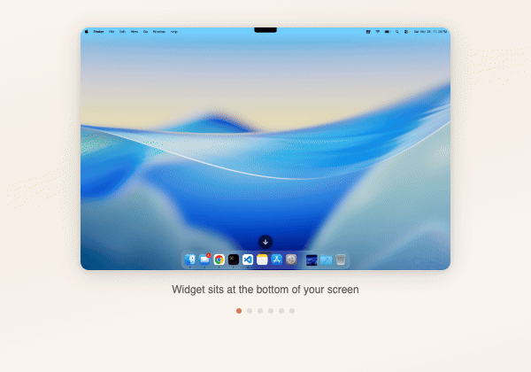
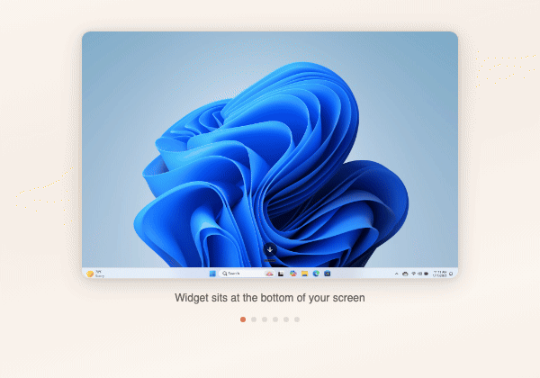

<p align="center">
  <h1 align="center">Yapper</h1>
  <p align="center">Voice-to-text desktop app that captures speech, refines transcripts with AI, and auto-pastes at your cursor</p>
</p>

<p align="center">
  <a href="https://github.com/karandeepbhardwaj/Yapper/actions"></a>
  <a href="https://github.com/karandeepbhardwaj/Yapper/releases"></a>
  <a href="LICENSE"></a>
  <a href="#"></a>
  <a href="#contributing"></a>
</p>

<p align="center">
  
</p>

### Onboarding Tutorial

<table>
<tr>
<td align="center"><strong>macOS</strong></td>
<td align="center"><strong>Windows</strong></td>
</tr>
<tr>
<td></td>
<td></td>
</tr>
</table>

---

## Features

- **Voice capture** -- press a global hotkey and start talking
- **Voice commands** -- speak `translate`, `summarize`, `draft`, `explain`, or `chain` to trigger AI actions directly; classified before refinement
- **On-device speech recognition** -- macOS `SFSpeechRecognizer` (offline) / Windows dual-engine: Classic (SAPI5 offline) or Modern (WinRT, higher accuracy)
- **Dual AI provider modes** -- choose in Settings:
  - **VS Code mode** -- routes through the local VS Code extension using `vscode.lm` / Copilot (no API key in the app)
  - **API Key mode** -- direct Groq or Anthropic calls from the app; no VS Code required
- **Auto-paste** refined text at your active cursor position
- **Conversation mode** -- back-and-forth AI chat with a dedicated hotkey (`Cmd+Shift+Y` / `Ctrl+Shift+Y`), session summaries saved to history
- **Recording modes** -- "Press" (toggle, default) or "Hold" (press-and-hold to record, release to stop; Fn key release supported on macOS)
- **Help screen** -- "How to Yapp" in-app guide with voice command reference
- **Onboarding tutorial** -- platform-specific animated tutorial (macOS dock / Windows taskbar) showing widget lifecycle, email paste workflow, and history dashboard
- **Dictionary** -- user-defined text replacements applied before AI refinement (e.g., "btw" -> "by the way"), handles trailing punctuation
- **Snippets** -- reusable text templates that bypass AI using word boundary matching (e.g., "my email" -> expands to your email address)
- **Style settings** -- per-category refinement tone (Professional, Casual, Technical, Creative) for Email, Messages, Work, Personal
- **Code mode** -- auto-detects file/variable names from VS Code workspace, preserves code references in backtick formatting
- **Metrics** -- usage tracking with streak days, word count, WPM, total recordings
- **Floating widget** -- follows you across macOS Spaces, positioned above dock/taskbar (dock-aware on macOS, drops to bottom in full-screen), click-through when not hovered; shows error messages on failure
- **History dashboard** -- fuzzy search (Fuse.js), pin/copy/delete with animations, sort by newest/oldest, multi-select category filter dropdown, action badges on cards
- **Theme persistence** -- Light / Dark / Auto theme with circle-reveal transition animation
- **iOS-style transitions** -- spring-based push/pop view transitions between app views
- **Settings page** -- AI provider mode, provider selection, API key (encrypted), theme, hotkeys, recording mode, style, dictionary, snippets, metrics, code mode; segmented controls and hint tooltips; settings reordered by UX priority. iOS 26 style "< Back" navigation
- **Customizable hotkeys** -- dictation: `Cmd+Shift+.` (macOS) / `Ctrl+Shift+.` (Windows); conversation: `Cmd+Shift+Y` / `Ctrl+Shift+Y`
- **Fn key recording** (macOS) -- use the Globe/Fn key as your trigger; Fn release stops recording in Hold mode
- **STT engine selection** (Windows) -- toggle between Classic (offline, no setup) and Modern (cloud-assisted, higher accuracy) with in-app permission guidance
- **Bridge authentication** -- random token written to `~/.yapper/bridge-token` secures the WebSocket connection
- **Circuit breaker** -- 3 consecutive bridge failures trigger 30s cooldown with automatic fallback to raw transcript (VS Code mode)
- **Atomic file writes** -- all persistence uses write-to-tmp-then-rename to prevent data corruption
- **API key encryption** -- API keys stored encrypted in settings; validated before saving via `test_api_key`

---

## Architecture

```
+--------------------------+                                +-------------------------+
|    Desktop App (Tauri)   |                                |   VS Code Extension     |
|                          |  WebSocket (127.0.0.1:9147)    |   (VS Code mode only)   |
|  +--------------------+  | <----------------------------> |                         |
|  |  React Frontend    |  |         local only              |  +-------------------+  |
|  |  (Tailwind+Motion) |  |                                 |  | WebSocket Server  |  |
|  +---------+----------+  |                                 |  | (ws, 127.0.0.1)   |  |
|            | IPC          |                                 |  +--------+----------+  |
|  +---------+----------+  |                                 |           |              |
|  |  Rust Backend       |  |                                 |  +--------+----------+  |
|  |  - Global Hotkey    |  |                                 |  | vscode.lm         |  |
|  |  - Native STT       |  |                                 |  | (Copilot only)    |  |
|  |  - Voice Cmd        |  |                                 |  +-------------------+  |
|  |    Classifier       |  |                                 +-------------------------+
|  |  - bridge.rs        |  |
|  |  - ai_provider.rs --+--+--> Groq / Anthropic (API Key mode, direct HTTPS)
|  |  - Auto-paste       |  |
|  |  - History          |  |
|  +--------------------+  |
+-----------+--------------+
            |
     +------+-------+
     | Native STT          |
     | macOS: Swift         |
     | Win: Classic (SAPI5) |
     |   or Modern (WinRT)  |
     | (on-device)          |
     +----------------------+
```

---

## Installation

### Desktop App

Download from the [latest release](https://github.com/karandeepbhardwaj/Yapper/releases):

| Platform | File |
|----------|------|
| macOS (Apple Silicon) | `Yapper_x.x.x_aarch64.dmg` |
| macOS (Intel) | `Yapper_x.x.x_x64.dmg` |
| Windows (installer) | `Yapper_x.x.x_x64-setup.exe` |
| Windows (MSI) | `Yapper_x.x.x_x64_en-US.msi` |

**macOS Gatekeeper fix** (unsigned app):
```bash
xattr -cr /Applications/Yapper.app
```

**Windows permissions**: Grant microphone access in Settings > Privacy > Microphone. For the Modern STT engine, enable Settings > Privacy & security > Speech > "Online speech recognition" (the app will guide you with a tooltip when needed).

### VS Code Extension (optional — VS Code mode only)

1. Download `yapper-bridge-x.x.x.vsix` from the [latest release](https://github.com/karandeepbhardwaj/Yapper/releases)
2. In VS Code: `Cmd+Shift+P` / `Ctrl+Shift+P` > **Extensions: Install from VSIX...** > select the `.vsix` file
3. The bridge auto-starts when VS Code opens -- look for the radio tower icon in the status bar

> **Note:** The VS Code extension is only required when using **VS Code mode**. In **API Key mode**, you can skip this step entirely — just enter your Groq or Anthropic API key in Yapper's Settings.

---

## Building from Source

### Prerequisites

| Dependency | Version | Install |
|---|---|---|
| Rust | 1.75+ | [rustup.rs](https://rustup.rs) |
| Node.js | 20+ | [nodejs.org](https://nodejs.org) |
| Bun | latest | [bun.sh](https://bun.sh) |
| Xcode CLI Tools (macOS) | latest | `xcode-select --install` |
| VS Code | latest | For testing the bridge |

### Build & Run

```bash
git clone https://github.com/karandeepbhardwaj/Yapper.git
cd Yapper

bun install

# Development mode (hot reload)
bun tauri dev

# Production build
bun tauri build
```

Build output: `apps/desktop/src-tauri/target/release/bundle/`

---

## How It Works

```
 Speak  -->  Record  -->  Transcribe  -->  Classify  -->  Refine/Execute  -->  Paste
  |            |              |               |                 |                 |
  |       Microphone     Native STT      Voice cmd?        LLM via           Keystroke
  |       capture        (on-device)    (translate,       VS Code or         simulation
  |                                      summarize,       direct API        (auto-paste)
  |                                       draft…)
```

1. **Speak** -- press `Cmd+Shift+.` / `Ctrl+Shift+.` (or click the floating widget, or press `Cmd+Shift+Y` / `Ctrl+Shift+Y` for conversation mode)
2. **Record** -- audio is captured from the microphone
3. **Transcribe** -- native speech recognition converts speech to text on-device
4. **Classify** -- AI-first intent classifier detects voice commands (translate, summarize, draft, explain, chain) and dispatches them; non-commands proceed to refinement
5. **Refine** -- in VS Code mode, the transcript is sent over a local WebSocket to the VS Code extension (vscode.lm); in API Key mode, `ai_provider.rs` calls Groq or Anthropic directly
6. **Paste** -- the refined or command-executed text is automatically pasted at your current cursor position

---

## AI Model Configuration

Yapper supports two AI provider modes. Select your preferred mode in **Settings > AI Provider**.

### VS Code Mode

Routes through the local VS Code extension using `vscode.lm` (Copilot). Install GitHub Copilot or another registered VS Code LLM extension. No API key required in the app.

> The VS Code extension no longer has API key fallback — it uses `vscode.lm` exclusively.

### API Key Mode

Makes direct calls to Groq or Anthropic from the app. VS Code is not required.

| Provider | Model | Setup |
|----------|-------|-------|
| Groq | Llama 3.3 70B | Enter Groq API key in Settings (free at [console.groq.com](https://console.groq.com)) |
| Anthropic | Claude Sonnet 4 | Enter Anthropic API key in Settings |

API keys are validated (`test_api_key`) and stored encrypted. If the key is invalid or missing, raw transcripts are pasted without refinement.

### Voice Commands

Once AI is configured, you can use voice commands by starting your recording with:

| Command | Example phrase | Action |
|---------|---------------|--------|
| `translate` | "translate this to French: ..." | Translates the spoken content |
| `summarize` | "summarize: ..." | Produces a concise summary |
| `draft` | "draft an email to the team about..." | Generates a full draft |
| `explain` | "explain what a closure is" | Explains a concept |
| `chain` | "translate then summarize: ..." | Chains multiple actions |

---

## Configuration

### Hotkeys

| Function | macOS Default | Windows Default | Customizable |
|----------|---------------|-----------------|-------------|
| Dictation | `Cmd+Shift+.` | `Ctrl+Shift+.` | Yes -- in Settings |
| Conversation | `Cmd+Shift+Y` | `Ctrl+Shift+Y` | Yes -- in Settings |
| Fn key | `Fn` (Globe key) | N/A | macOS only |

### Recording Modes

| Mode | Behavior |
|------|----------|
| Press (default) | Press hotkey to start, press again to stop |
| Hold | Hold hotkey to record, release to stop (Fn key release also stops on macOS) |

Configurable in Settings.

### Settings

Settings are persisted per-platform in the app config directory using atomic file writes:
- macOS: `~/Library/Application Support/com.yapper.app/settings.json`
- Windows: `%APPDATA%/com.yapper.app/settings.json`

| Setting | Default | Description |
|---------|---------|-------------|
| `ai_provider_mode` | `vscode` | AI routing: "vscode" (bridge) or "apikey" (direct) |
| `ai_provider` | `groq` | Direct provider in API Key mode: "groq" or "anthropic" |
| `ai_api_key` | -- | Encrypted API key for API Key mode |
| `theme` | `Auto` | UI theme: "Light", "Dark", or "Auto" |
| `hotkey` | `Cmd+Shift+.` / `Ctrl+Shift+.` | Dictation hotkey |
| `conversation_hotkey` | `Cmd+Shift+Y` / `Ctrl+Shift+Y` | Conversation mode hotkey |
| `recording_mode` | `Press` | "Press" (toggle) or "Hold" (press-and-hold) |
| `stt_engine` | `classic` | Windows STT engine ("classic" or "modern") |
| `default_style` | `Professional` | Default refinement style |
| `style_overrides` | `{}` | Per-category style overrides |
| `metrics_enabled` | `true` | Usage metrics tracking |
| `code_mode` | `false` | Code reference detection |

---

## Widget States

```
+----------+       +----------+       +----------+
|          |       |          |       |          |
|   IDLE   | ----> |LISTENING | ----> |PROCESSING|
|          |       |          |       |          |
|  (gray)  |       | (orange) |       | (gradient)|
+----------+       +----------+       +----------+
     ^                                      |
     +--------------------------------------+
                  done / error
```

| State | Appearance | Meaning |
|---|---|---|
| Idle | Thin gray pill, expands on hover | Ready to record |
| Listening | Orange with wave bars + stop/cancel | Recording speech |
| Processing | Animated hue gradient | Refining through AI |

---

## Tech Stack

| Layer | Technology |
|---|---|
| Desktop framework | [Tauri 2](https://v2.tauri.app) (Rust) |
| Frontend | React 18, TypeScript, Tailwind CSS 4 |
| Animations | Motion (Framer Motion) |
| Speech-to-text (macOS) | `SFSpeechRecognizer` via Swift subprocess |
| Speech-to-text (Windows) | Classic: SAPI5 via PowerShell, Modern: `Windows.Media.SpeechRecognition` |
| AI refinement | Multi-provider: Groq, Gemini, Claude, Copilot |
| Bridge protocol | WebSocket (`ws`) on `127.0.0.1:9147` |
| Search | Fuse.js (fuzzy search) |
| macOS interop | `objc2` + `objc2-app-kit` + `block2` |
| Windows interop | `windows` crate (Win32 + WinRT) |
| Build tooling | Vite, esbuild, bun workspaces |
| CI/CD | GitHub Actions (macOS + Windows builds) |

---

## Contributing

Contributions are welcome! Please read **[CONTRIBUTING.md](CONTRIBUTING.md)** for details on setting up the development environment, code style, and how to submit pull requests.

---

## License

This project is licensed under the **MIT License** -- see the [LICENSE](LICENSE) file for details.

Copyright 2026 Yapper contributors.
